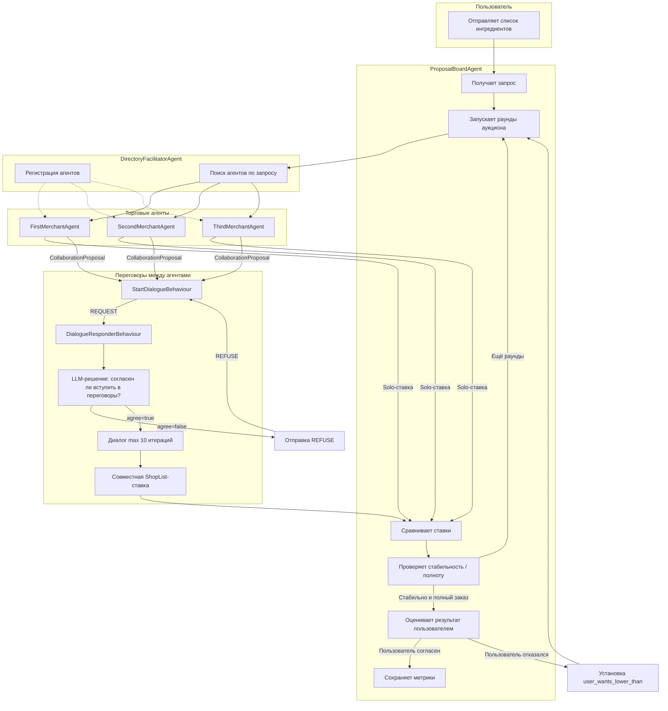

# Схема процесса аукциона

## Обзор

Данная диаграмма описывает полный цикл аукциона ингредиентов между пользователем, доской аукциона (`ProposalBoardAgent`) и торговыми агентами (`FirstMerchantAgent`, `SecondMerchantAgent`, `ThirdMerchantAgent`).

## Этапы процесса

### 1. Инициализация
- Пользователь отправляет запрос на `ProposalBoardAgent` со списком ингредиентов.
- `ProposalBoardAgent` инициализирует `ProposalBoard` (пустая доска + запрос).

### 2. Поиск агентов
- Для каждого раунда `ProposalBoardAgent` через `AuctionContractNetInitiatorBehavior` обращается к `DirectoryFacilitatorAgent`.
- `DirectoryFacilitatorAgent` возвращает список подходящих торговых агентов.

### 3. Сбор предложений
- `AuctionContractNetInitiatorBehavior` рассылает `request_proposal` каждому найденному агенту.
- Агенты через `AuctionBidderBehaviour` принимают решение:
  - **Solo-ставка** — сразу возвращают `ShopList` со своими ценами.
  - **CollaborationProposal** — хотят договориться с другим агентом.

### 4. Переговоры (опционально)
- Если агент выбрал `CollaborationProposal`, запускается `StartDialogueBehaviour`.
- `DialogueResponderBehaviour` на стороне партнёра **сперва спрашивает LLM** (заглушка): «Хочешь ли вступить в переговоры с агентом X?»
  - Если **нет** — отправляется `REFUSE`, диалог не начинается.
  - Если **да** — запускается стандартный цикл переговоров (max 10 итераций).
- По итогам переговоров формируется совместная `ShopList`-ставка.

### 5. Выбор победителя
- `AuctionContractNetInitiatorBehavior` сравнивает все полученные ставки:
  - Приоритет у ставки, покрывающей больше ингредиентов.
  - При равном покрытии — у ставки с меньшей ценой.
- Проигравшие получают `REFUSE`.

### 6. Проверка стабильности
- `ProposalBoardAgent` отслеживает, сколько раундов подряд побеждает одна и та же ставка (`stable_limit`).
- Если ставка стабильна **и** заказ полностью собран — аукцион завершается досрочно.

### 7. Оценка пользователем
- Вызывается `user_decision()` — вероятностная модель принятия решения пользователем.
- Если пользователь **согласен**:
  - Отправляется `INFORM` с итоговой ценой.
  - Сохраняются метрики и `bid_ingredient_split`.
- Если пользователь **отказывается**:
  - Устанавливается `user_wants_lower_than`.
  - Доска сбрасывается, запускается **повторный аукцион** (до 3 попыток).

## Участники

| Участник | Роль |
|----------|------|
| `ProposalBoardAgent` | Управляет доской аукциона, запускает раунды, выбирает победителя, оценивает результат |
| `DirectoryFacilitatorAgent` | Регистрирует агентов и ищет подходящих под запрос |
| `FirstMerchantAgent` | Торговый агент #1 (ассортимент + цены) |
| `SecondMerchantAgent` | Торговый агент #2 (ассортимент + цены) |
| `ThirdMerchantAgent` | Торговый агент #3 (ассортимент + цены) |
| LLM (GigaChat) | Принимает решения о ставках, ведёт переговоры, оценивает согласие на переговоры |

## Новая фича: Отказ от переговоров

Реализована в `DialogueResponderBehaviour`:
1. При получении первого `REQUEST` от инициатора вызывается LLM с промптом `NEGOTIATION_DECISION_PROMPT`.
2. Если ответ `agree=false` — немедленно отправляется `REFUSE` с причиной.
3. Если ответ `agree=true` — продолжается стандартный цикл переговоров.

На стороне инициатора (`StartDialogueBehaviour`) ожидание ответа расширено с `ACKNOWLEDGE`-only на любой ответ; при получении `REFUSE` диалог корректно завершается.
